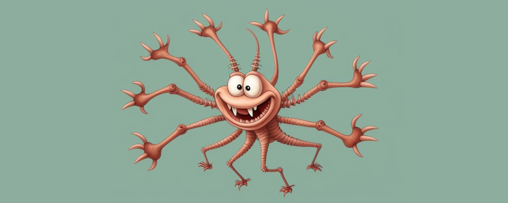
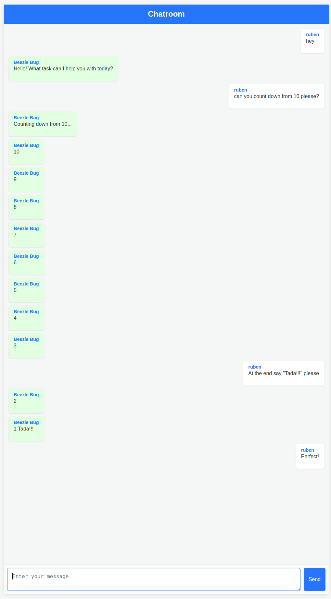
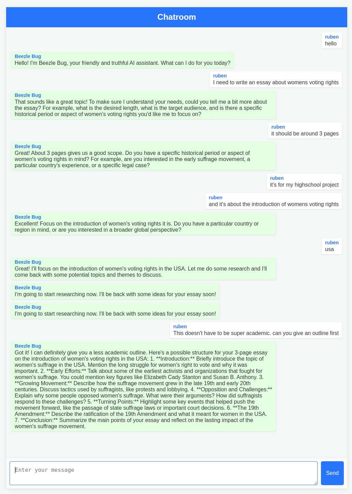

# Beezle Bug
In the [Otherland](https://en.wikipedia.org/wiki/Otherland) series of cyberpunk novels Beezle Bug is the virtual assistant of Orlando Gardiner, one of the main characters.
Originally a kids' toy, it was upgraded many times until it's almost as sentient as a real person.
Beezle Bug has two different forms of appearance. In the virtual world it appears as a creature with many arms and legs. It can also download itself into a spider-like toy robot in the physical world.

## Vision and Goals
Like its fictional counterpart our Beezle Bug agent starts as a limited toy project and will hopefully grow into a useful tool over time.
Beezle is running completely locally and requires a running llama.cpp server. 

With Beezle Bug we want to explore agentive behaviours like
* Autonomy
* Open-Endedness
* Cooperation
* Self Improvement

### Autonomy
Beezle Bug is an autonomous and proactive agent.

What's working ?
- [x] Run continuously every n seconds
- [x] [Tool Use](docs/tools.md)
- [x] [Memory Management](docs/memory_management.md)
- [ ] Planning

### Cooperation
To be able to work on several things at the same time without confusing itself, Beezle Bug can clone itself and give its clone specific instructions.

What's working ?
- [ ] Create/start/stop/destroy a clone of itself
- [ ] Delegate tasks to clone
- [ ] Specialize the clone for specific tasks

### Self Improvement

What's working ?

- [ ] Create new compound tools
- [ ] Create new primitive tools
- [ ] Fine tune self on collected data

## Examples

#### Web Chat
There is a web chat example [here](examples/webchat/README.md).
The example in the image below uses Gemma2-9B. It shows nicely how the agent can execute multiple actions without having to be prompted each time.

This is pretty solid for such a small model.

