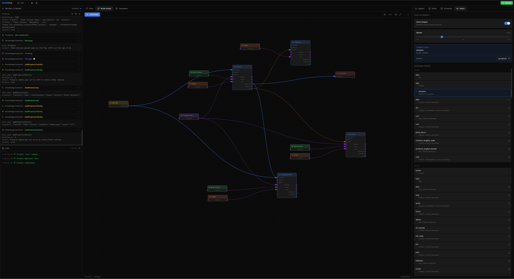

# Beezle Bug

> *A visual agent graph builder inspired by the AI companion from Tad Williams' [Otherland](https://en.wikipedia.org/wiki/Otherland) series*

**Beezle Bug** is a local-first, visual tool for building and orchestrating AI agent systems. Design multi-agent workflows with a node-based editor, connect agents to knowledge graphs and memory streams, and deploy them instantly—all from a modern dark-themed interface.

## 🎯 Features

- **Visual Node Graph Editor** – Drag-and-drop interface for building agent pipelines
- **Multi-Agent Orchestration** – Create and connect multiple specialized agents
- **Knowledge Graphs** – Persistent entity-relationship storage for agent memory
- **Memory Streams** – Observation-based short-term memory for agents
- **Template System** – Jinja2 templates for agent system prompts
- **Scheduled Events** – Timer-based autonomous agent triggering
- **Text-to-Speech** – Integrated Piper TTS with voice selection
- **Voice Input** – Wake word-activated speech-to-text with Whisper
- **Real-time Introspection** – Watch agent reasoning in real-time
- **Fully Local or Cloud** – Run entirely on your machine with local LLMs, or connect to remote APIs via LiteLLM

---

## 📸 Interface Overview

Beezle Bug features a three-column layout with resizable panels:

### Interface


*The full Beezle Bug interface showing all panels*

---

### 1. Menu Bar

The top menu bar provides:
- **Project Selector** – Create, load, and switch between projects
- **Save/Delete** – Quick actions for project management
- **Deploy/Stop** – One-click deployment of your agent graph

---

### 2. Neural Stream (Left Panel - Top)

Real-time introspection of agent activity:
- **Message events** – When agents receive input
- **Thinking** – LLM reasoning in progress
- **Tool calls** – Tools being selected and executed
- **Filtering** – Filter by agent or event type
- **Expandable events** – Click to see full details

---

### 3. Log Panel (Left Panel - Bottom)

System logs with color-coded entries:
- ✅ Success messages (green)
- ℹ️ Info messages (blue)
- ⚠️ Warnings (yellow)
- ❌ Errors (red)

---

### 4. Chat Tab (Center Panel)

Conversation interface with deployed agents:
- **Markdown support** – Code blocks, lists, links
- **Audio playback** – TTS-generated responses
- **Voice input indicator** – Shows listening state (idle/active)
- **User input** – Send messages via text or voice

---

### 5. Node Graph Tab (Center Panel)

Visual editor for building agent pipelines:

| Node Type | Description |
|-----------|-------------|
| 🤖 **Agent** | LLM-powered agent with configurable model and template |
| 🧠 **Knowledge Graph** | Persistent entity-relationship storage |
| 💾 **Memory Stream** | Observation-based memory buffer |
| 🔧 **Toolbox** | Collection of tools an agent can use |
| 💬 **User Chat** | Input from the user interface |
| 🖥️ **User Display** | Output to the chat interface |
| ⏰ **Scheduled Event** | Timer trigger for autonomous operation |
| 🔀 **Wait & Combine** | Rendezvous point that waits for all inputs before forwarding |

**Connection Types:**
- **Message** (blue) – Agent-to-agent or event-to-agent communication
- **Pipeline** (green) – Data flow
- **Resource** (purple, dashed) – Shared resources
- **Delegate** (orange, dashed) – Task delegation

---

### 6. Template Editor Tab (Center Panel)

Edit and manage Jinja2 templates for agent system prompts:
- **Template list** – All available templates
- **Syntax highlighting** – Jinja2 + Markdown
- **Create/Save/Delete** – Full template management
- **Unsaved changes indicator** – Visual feedback

Built-in templates include:
- `agent.j2` – General-purpose agent
- `researcher.j2` – Research-focused agent
- `planner.j2` – Task planning agent
- `python_programmer.j2` – Code-focused agent
- `summarizer.j2` – Text summarization
- And more...

---

### 7. Settings Panel (Right Panel - Top)

Tabbed configuration interface:

#### Agents Tab
View and manage running agent instances.

#### Node Inspector Tab

Configure the selected node's properties:
- Agent: Model, API URL, system template
- Knowledge Graph: Name
- Memory Stream: Max observations
- Toolbox: Available tools
- Scheduled Event: Trigger type, interval, and message content
- Wait & Combine: Name (rendezvous behavior is automatic)

#### Schedule Tab
View and manage scheduled events.

#### Voice Tab

**Voice Input (Speech-to-Text):**
- **Continuous Listening** – Enable/disable wake word detection
- **Microphone Selection** – Choose input device
- **Wake Words** – Configurable phrases to activate voice input (e.g., "Hey Beezle")
- **Stop Words** – Phrases to deactivate voice input (e.g., "Stop listening")
- **Max Recording Duration** – Adjustable buffer size (5–60 seconds) for longer utterances

When enabled, the system listens continuously for wake words. Once detected, all subsequent speech is transcribed and sent to agents until a stop word is spoken. The max recording duration slider controls how much audio can be buffered before it's processed—increase this if your speech is being cut off.

**Voice Output (Text-to-Speech):**
- Enable/disable TTS
- Voice selection (150+ Piper voices)
- Speed adjustment (0.5x - 2.0x)
- Speaker selection (for multi-speaker voices)

---

### 8. Knowledge Graph View (in Node Inspector)

When a Knowledge Graph node is selected, the Node Inspector displays:
- **Entities** – Named objects with types and properties
- **Relationships** – Connections between entities
- **Real-time updates** – Watch the graph grow as agents learn
- **Selection details** – Click to view entity/relationship properties

---

## 🚀 Quick Start

### Prerequisites

- Docker & Docker Compose
- An LLM server (OpenAI-compatible API or local llama.cpp)

### Installation

```bash
# Clone the repository
git clone https://github.com/rhohndorf/beezle-bug.git
cd beezle-bug

# Start the services
docker compose up -d

# Frontend available at http://localhost:5173
# Backend API at http://localhost:5000
```

### First Agent Graph

1. **Create a Project** – Click the folder icon → "New Project"
2. **Add Nodes** – Click "+" in the Node Graph tab
   - Add an **Agent** node
   - Add a **User Chat** node
   - Add a **User Display** node
3. **Connect Nodes** – Drag from output ports to input ports
   - User Chat → Agent (message)
   - Agent → User Display (message)
4. **Configure Agent** – Select the agent node and configure:
   - API URL: Your LLM endpoint (e.g., `http://127.0.0.1:1234/v1`)
   - Model: Your model name
   - Template: Choose a system template
5. **Deploy** – Click the green "Deploy" button
6. **Chat** – Switch to the Chat tab and start talking!

---

## 🏗️ Architecture

```
┌─────────────────────────────────────────────────────────────┐
│                        Frontend (React)                      │
│   NodeGraph │ Chat │ Templates │ Settings │ KnowledgeGraph  │
└────────────────────────────┬────────────────────────────────┘
                             │ Socket.IO
┌────────────────────────────┴────────────────────────────────┐
│                      Backend (Flask)                         │
│  ┌──────────────┐  ┌──────────────┐  ┌──────────────┐       │
│  │ ProjectMgr   │  │   Runtime    │  │   Storage    │       │
│  └──────────────┘  └──────────────┘  └──────────────┘       │
│         │                 │                  │               │
│  ┌──────┴─────────────────┴──────────────────┴─────┐        │
│  │              Agent Graph Engine                  │        │
│  │  Agents │ KnowledgeGraph │ MemoryStream │ Tools │        │
│  └─────────────────────────────────────────────────┘        │
└─────────────────────────────────────────────────────────────┘
                             │
              ┌──────────────┼──────────────┐
              ▼              ▼              ▼
         ┌────────┐    ┌─────────┐    ┌─────────┐
         │Local   │    │ OpenAI  │    │ LiteLLM │
         │llama   │    │   API   │    │         │
         └────────┘    └─────────┘    └─────────┘
```

---

## 📁 Project Structure

```
beezle-bug/
├── backend/
│   ├── beezle_bug/
│   │   ├── agent_graph/      # Agent graph models and runtime
│   │   ├── llm_adapter/      # LLM provider adapters
│   │   ├── memory/           # Knowledge graph & memory stream
│   │   ├── tools/            # Agent tools
│   │   └── voice/            # TTS (Piper) and STT (Whisper)
│   └── server.py             # Flask + SocketIO server
├── frontend/
│   └── src/
│       ├── components/       # React components
│       └── App.jsx           # Main application
├── data/
│   ├── projects/             # Saved projects
│   ├── templates/            # Jinja2 system templates
│   └── voices/               # Piper TTS voice models
└── docker-compose.yml
```

---

## 🛠️ Available Tools

Agents can use these built-in tools:

| Category | Tools |
|----------|-------|
| **Knowledge Graph** | AddEntity, AddRelationship, AddPropertyToEntity, QueryEntities, QueryRelationships |
| **Memory** | AddObservation, RecallObservations, GetRecentObservations |
| **Web** | SearchWeb, SearchNews, ReadWebsite |
| **Filesystem** | ReadFile, WriteFile, ListDirectory |
| **System** | ExecuteCommand, RunPython |

---

## 🔮 Vision & Roadmap

### Autonomy ✅
- [x] Continuous autonomous operation
- [x] Tool use and execution
- [x] Memory management

### Cooperation 🚧
- [x] Multi-agent task delegation
- [ ] Agent specialization

### Self-Improvement 🔮
- [ ] Dynamic tool creation
- [ ] Self-fine-tuning

---

## 📄 License

This project is licensed under the MIT License - see the [LICENSE](LICENSE) file for details.

---

## 🙏 Acknowledgments

- Tad Williams for the [Otherland](https://en.wikipedia.org/wiki/Otherland) series
- [Piper TTS](https://github.com/rhasspy/piper) for local text-to-speech
- [faster-whisper](https://github.com/SYSTRAN/faster-whisper) for speech recognition
- [LiteLLM](https://github.com/BerriAI/litellm) for unified LLM API access
- [React Flow](https://reactflow.dev/) inspiration for the node graph
- The open-source AI community
